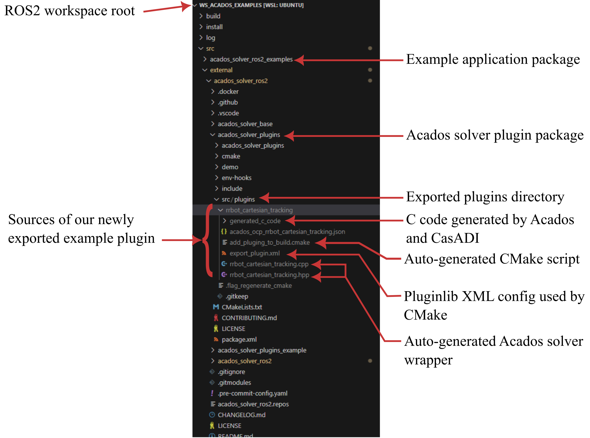

ROS2 controller
============================

In the previous section, we used Acados to define an optimal control problem (OCP) and solver with Acados.

In this section, we will show how to generate a solver for C++ ROS2 controllers and how to use it.

Export the solver plugin
-------------------------

To use the Acados solver in a C++ ROS2 controller, we first need to export the solver as a ``pluginlib`` plugin.
The Python module ``acados_solver_plugins`` provides a class ``SolverPluginGenerator`` to generate the plugin:

.. autoclass:: acados_solver_plugins.SolverPluginGenerator
    :noindex:
    :members:
    :undoc-members:
    :private-members:
    :exclude-members:

Note that the ``generate_solver_plugin`` method of the ``SolverPluginGenerator`` class takes semantic maps as arguments, mapping variable names to their indices in the state, control, and parameter vectors.

For the RRBot example, the export script is as follows:

.. code-block:: python

    model = AcadosModel()
    ...  # define the model (see previous section)
    ocp = AcadosOcp()
    ...  # define the OCP (see previous section)

    # define the semantic map of the OCP variables
    x_index_map = {
        'q': [0, 1],
        'q_dot': [2, 3],
    }
    z_index_map = {}  # N.B., actually not empty in demo code
    p_index_map = {
        'l0': [0],
        'l1': [1],
        'l2': [2],
        'm1': [3],
        'm2': [4],
        'p_ref': [5, 6],
        'p_dot_ref': [7, 8],
        'Q_pos_diag': [9, 10],
        'Q_vel_diag': [11, 12],
        'R_diag': [13, 14],
    }
    u_index_map = {
        'tau': [0, 1],
    }

    # export the solver plugin
    from acados_solver_plugins import SolverPluginGenerator

    solver_plugin_generator = SolverPluginGenerator()

    solver_plugin_generator.generate_solver_plugin(
        ocp=ocp,
        plugin_class_name='RrbotCartesianTracking',
        solver_description='Acados solver plugin to track a Cartesian trajectory with the RRBot planar robot',  # noqa: E501
        x_index_map=x_index_map,
        z_index_map=z_index_map,
        p_index_map=p_index_map,
        u_index_map=u_index_map,
    )

The full code can be found in the `export_acados_solver_plugin.py <https://github.com/ICube-Robotics/acados_solver_ros2_examples/blob/main/example_acados_controller/script/export_acados_solver_plugin.py>`_ file in the ``example_acados_controller/script`` directory of the `acados_solver_ros2_examples <https://github.com/ICube-Robotics/acados_solver_ros2_examples>`_ repository.

To export the plugin, simply run the script with Python:

.. code-block:: bash

    source install/setup.bash
    python3 ./<relative_path_to_script>.py

Which results in the following workspace tree:

As shown in the figure, the plugin sources are exported to the ``src`` directory of the ``acados_solver_plugins`` package.

The wrapper inherits from the :class:`acados::AcadosSolver` class, resulting in the following pluginlib XML config (i.e., the ``export_plugin.xml`` file):

.. code-block:: xml

    <library path="acados_solver_plugins">
    <class name="acados_solver_plugins/RrbotCartesianTracking"
            type="acados_solver_plugins::RrbotCartesianTracking"
            base_class_type="acados::AcadosSolver">
        <description>
        Acados solver plugin to track a Cartesian trajectory with the RRBot planar robot
        </description>
    </class>
    </library>

In order to use the plugin in a C++ ROS2 controller, we will need to rebuild the ``acados_solver_plugins`` package:

.. code-block:: bash

    source install/setup.bash
    colcon build --cmake-args -DCMAKE_BUILD_TYPE=Release --symlink-install

Use the plugin in a C++ controller
-----------------------------------

1) Setup the ROS2 controller package dependencies
~~~~~~~~~~~~~~~~~~~~~~~~~~~~~~~~~~~~~~~~~~~~~~~~~~

Add the ``acados_solver_base`` and ``acados_solver_plugins`` packages as dependencies of the ROS2 controller package :

.. code-block:: xml

    <!-- In package.xml>

    ...
    <build_depend>acados_solver_base</build_depend>

    <exec_depend>acados_solver_base</exec_depend>
    <exec_depend>acados_solver_plugins</exec_depend>
    ...

.. code-block:: cmake

    # In CMakeLists.txt
    # ...
    find_package(acados_solver_base REQUIRED)
    # ...
    ament_target_dependencies(
        example_acados_controller
        PUBLIC
            # ...
            acados_solver_base
    )

The full code can be found in the `package.xml <https://github.com/ICube-Robotics/acados_solver_ros2_examples/blob/main/example_acados_controller/package.xml>`_ and `CMakeLists.txt <https://github.com/ICube-Robotics/acados_solver_ros2_examples/blob/main/example_acados_controller/CMakeLists.txt>`_ files in the ``example_acados_controller`` directory of the `acados_solver_ros2_examples <https://github.com/ICube-Robotics/acados_solver_ros2_examples>`_ repository.

2) Load the solver plugin in the ROS2 controller
~~~~~~~~~~~~~~~~~~~~~~~~~~~~~~~~~~~~~~~~~~~~~~~~

Define a ROS2 controller with a pluginlib loader to load the solver plugin:

.. code-block:: cpp

    // In example_acados_controller.hpp

    // ...
    #include "acados_solver_base/acados_solver_base.hpp"
    #include "pluginlib/class_loader.hpp"

    namespace example_acados_controller
    {

    class ExampleAcadosController : public controller_interface::ControllerInterface
    public:
        ExampleAcadosController();

        CallbackReturn on_init() override;

        controller_interface::InterfaceConfiguration command_interface_configuration() const override;

        controller_interface::InterfaceConfiguration state_interface_configuration() const override;

        CallbackReturn on_configure(const rclcpp_lifecycle::State & previous_state) override;

        // ...

        controller_interface::return_type update(
            const rclcpp::Time & time,
            const rclcpp::Duration & period) override;

    protected:
        // ...

        /// Acados solver pluginlib loader
        std::shared_ptr<pluginlib::ClassLoader<acados::AcadosSolver>> acados_solver_loader_;

        /// Acados solver
        std::unique_ptr<acados::AcadosSolver> acados_solver_;

        // ...
    };

    }  // namespace example_acados_controller

The full code can be found in the `example_acados_controller.hpp <https://github.com/ICube-Robotics/acados_solver_ros2_examples/blob/main/example_acados_controller/include/example_acados_controller/example_acados_controller.hpp>`_ files in the ``example_acados_controller/include`` directory of the `acados_solver_ros2_examples <https://github.com/ICube-Robotics/acados_solver_ros2_examples>`_ repository.

3) Configure the solver plugin in the ROS2 controller
~~~~~~~~~~~~~~~~~~~~~~~~~~~~~~~~~~~~~~~~~~~~~~~~~~~~~~~

The solver plugin can be loaded and configured in the ``on_configure`` method of the ROS2 controller.
Additionally, the solver should be reset in the ``on_activate`` method (not shown here).
Note that the solver settings (e.g., the number of shooting nodes and the sampling time) can be changed at runtime:

.. code-block:: cpp

    // In example_acados_controller.cpp

    #include "example_acados_controller/example_acados_controller.hpp"

    // ...

    namespace example_acados_controller
    {

    // ...

    CallbackReturn
    ExampleAcadosController::on_configure(const rclcpp_lifecycle::State & /*previous_state*/)
    {
        // ...

        // get solver settings
        std::string nmpc_plugin_name = "acados_solver_plugins/RrbotCartesianTracking";
        int N = 10; // number of shooting nodes (i.e., the prediction horizon)
        double Ts = 0.002; // 500 Hz

        // load the solver plugin
        acados_solver_loader_ =
            std::make_shared<pluginlib::ClassLoader<acados::AcadosSolver>>(
            "acados_solver_base", "acados::AcadosSolver");
        acados_solver_ = std::unique_ptr<acados::AcadosSolver>(
            acados_solver_loader_->createUnmanagedInstance(nmpc_plugin_name));

        // configure the solver
        if (0 != acados_solver_->init(N, Ts)) {
            RCLCPP_ERROR(
                get_node()->get_logger(), "Failed to configure the Acados solver!");
            return CallbackReturn::FAILURE;
        }

        // ...
    }

    // ...

    }  // namespace example_acados_controller

The full code can be found in the `example_acados_controller.cpp <https://github.com/ICube-Robotics/acados_solver_ros2_examples/blob/main/example_acados_controller/src/example_acados_controller.cpp>`_ files in the ``example_acados_controller/src`` directory of the `acados_solver_ros2_examples <https://github.com/ICube-Robotics/acados_solver_ros2_examples>`_ repository.

3) Solve the OCP
~~~~~~~~~~~~~~~~~

The OCP can be solved in the ``update`` method of the ROS2 controller:

.. code-block:: cpp

    // In example_acados_controller.cpp

    // ...

    namespace example_acados_controller
    {

    // ...

    controller_interface::return_type
    ExampleAcadosController::update(
        const rclcpp::Time & time,
        const rclcpp::Duration & period)
    {
        // get runtime parameters
        std::vector<double> Q_pos_diag = {0.0, 0.0};
        std::vector<double> Q_vel_diag = {0.0, 0.0};
        std::vector<double> R_diag = {0.0, 0.0};
        double l0 = 0.0;
        // ...

        // get the current joint state
        std::vector<double> q_pos = {0.0, 0.0};
        std::vector<double> q_vel = {0.0, 0.0};

        // set the OCP initial state
        acados::ValueMap x_values_map;
        x_values_map["q"] = q_pos;
        x_values_map["q_dot"] = q_vel;

        if (0 != acados_solver_->set_initial_state_values(x_values_map)) {
            RCLCPP_ERROR(
                get_node()->get_logger(), "Failed to set NMPC initial state values!");
            return controller_interface::return_type::ERROR;
        }

        // get the Cartesian reference
        std::vector<double> p_ref = {0.0, 0.0};
        std::vector<double> p_dot_ref = {0.0, 0.0};

        // set the OCP parameters
        acados::ValueMap p_values_map;
        p_values_map["l0"] = std::vector{l0};
        p_values_map["l1"] = std::vector{l1};
        p_values_map["l2"] = std::vector{l2};
        p_values_map["m1"] = std::vector{m1};
        p_values_map["m2"] = std::vector{m2};
        p_values_map["p_ref"] = p_ref;
        p_values_map["p_dot_ref"] = p_dot_ref;
        p_values_map["Q_pos_diag"] = Q_pos_diag;
        p_values_map["Q_vel_diag"] = Q_vel_diag;
        p_values_map["R_diag"] = R_diag;

        if (0 != acados_solver_->set_runtime_parameters(p_values_map)) {
            RCLCPP_ERROR(
                get_node()->get_logger(), "Failed to set NMPC runtime parameters!");
            return controller_interface::return_type::ERROR;
        }

        // solve the OCP
        bool all_ok = true;
        std::vector<double> tau_cmd = {0.0, 0.0};
        if (0 != acados_solver_->solve()) {
            RCLCPP_ERROR(get_node()->get_logger(), "Failed to solve the NMPC SQP problem!");
            all_ok = false;
        } else {
            // Get optimal control input
            acados::ValueMap u_values_map = acados_solver_->get_control_values_as_map(0);
            tau_cmd[0] = u_values_map["tau"][0];
            tau_cmd[1] = u_values_map["tau"][1];
        }

        // Send command to robot
        // ...
    }
    // ...

    }  // namespace example_acados_controller

The full code can be found in the `example_acados_controller.cpp <https://github.com/ICube-Robotics/acados_solver_ros2_examples/blob/main/example_acados_controller/src/example_acados_controller.cpp>`_ files in the ``example_acados_controller/src`` directory of the `acados_solver_ros2_examples <https://github.com/ICube-Robotics/acados_solver_ros2_examples>`_ repository.

Notes and recommendations
--------------------------

- If not provided, the semantic map is constructed from CasADI variable names.

- By default, the plugin sources are exported to the src directory of the ``acados_solver_plugins`` package.
  This can be changed by setting the ``plugin_sources_dir`` argument of the ``generate_solver_plugin`` method.

- If the Acados solver C library is generated for the first time, the user will be prompted to install some Acados external dependencies.
  This can be avoided by running the script as follows:

    .. code-block:: bash

        echo "y" | python3 ./<relative_path_to_script>.py

- The :class:`ValueMap` class is a simple wrapper around a :class:`std::map` to store the values of the OCP variables.
  It is a convenient way to pass the values to the Acados solver, but it is not mandatory.
  The user can directly set the values from a :class:`std::vector` object, which might be more efficient as the :class:`ValueMap` setters are not especially optimized.
