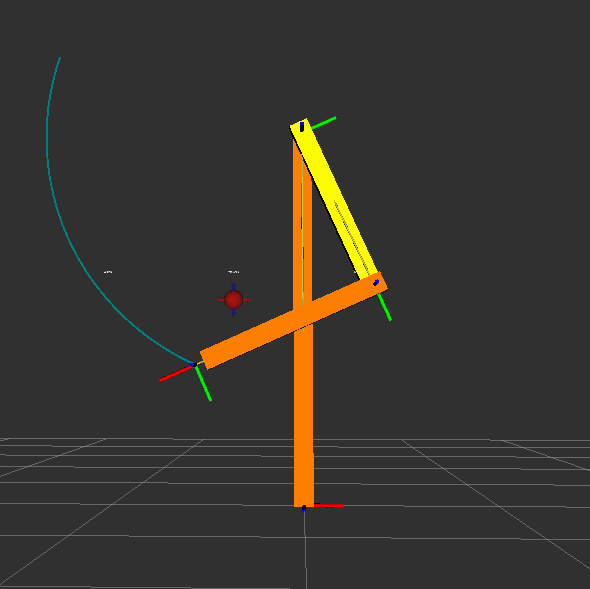
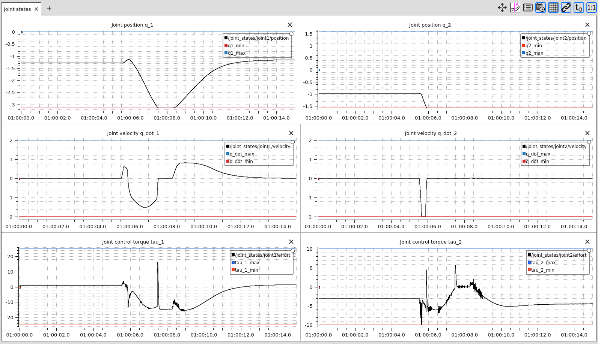

Illustrative results
============================

This section presents the results of the example package provided in the `ICube-Robotics/acados_solver_ros2_examples <https://github.com/ICube-Robotics/acados_solver_ros2_examples/tree/main>`_ repository.

An interactive Rviz marker is used to set the desired position (i.e., :math:`p^d`) of the end-effector of the robot.
The user can change the desired position of the end-effector by dragging the interactive marker (see red marker in :numref:`fig-demo-rviz-view`).

A Python node updates the marker server and publishes the desired position and velocity (that is simply set to :math:`\dot{p}^d = 0`) to the controller.
The controller computes the control input to track the desired position and velocity of the end-effector.
It is implemented as described in the previous sections.

.. _fig-demo-rviz-view:

   Visualization of the robot in Rviz2.

Installation of the example package and launch
----------------------------------------------

1) Install dependencies
~~~~~~~~~~~~~~~~~~~~~~~~

.. code-block:: bash

    source /opt/ros/humble/setup.bash

    mkdir ~/ros2_ws/src
    cd ~/ros2_ws/src
    git clone https://github.com/ICube-Robotics/acados_solver_ros2_examples.git
    vcs import . < acados_solver_ros2_examples/acados_solver_ros2_examples.repos
    rosdep install --ignore-src --from-paths . -y -r

2) Build and install ros2 packages
~~~~~~~~~~~~~~~~~~~~~~~~~~~~~~~~~~~

.. code-block:: bash

    cd ~/ros2_ws/
    colcon build --cmake-args -DCMAKE_BUILD_TYPE=Release --symlink-install
    # N.B., build a second time to export the acados_template python package
    colcon build --cmake-args -DCMAKE_BUILD_TYPE=Release --symlink-install

3) Export and build the Acados solver plugins
~~~~~~~~~~~~~~~~~~~~~~~~~~~~~~~~~~~~~~~~~~~~~~

.. code-block:: bash

    cd ~/ros2_ws/
    source install/setup.bash

    cd src/acados_solver_ros2_examples
    echo "y" | python3 ./example_acados_controller/script/export_acados_solver_plugin.py
    cd ../..

    colcon build --cmake-args -DCMAKE_BUILD_TYPE=Release --symlink-install

4) Launch demo
~~~~~~~~~~~~~~

.. code-block:: bash

    cd ~/ros2_ws/
    source install/setup.bash

    ros2 launch example_acados_bringup launch_demo.launch.py launch_plotjuggler:=true

Constraints satisfaction
-------------------------

The robot joint state plots are shown in :numref:`fig-fig-demo-plotjuggler-view`.
The first row shows the joint positions, the second shows the joint velocities, and the bottom raw the torques.
NMPC state and control constraints are displayed using the blue and red lines.
As visible in :numref:`fig-fig-demo-plotjuggler-view`, the controller successfully respects the constraints while tracking the desired position.

.. _fig-fig-demo-plotjuggler-view:

   Robot joint state plots in Plotjuggler

Cartesian position tracking
---------------------------

.. _video-demo-tracking:
.. video:: ../images/video_tracking_position_rviz2.mp4
   :width: 800
