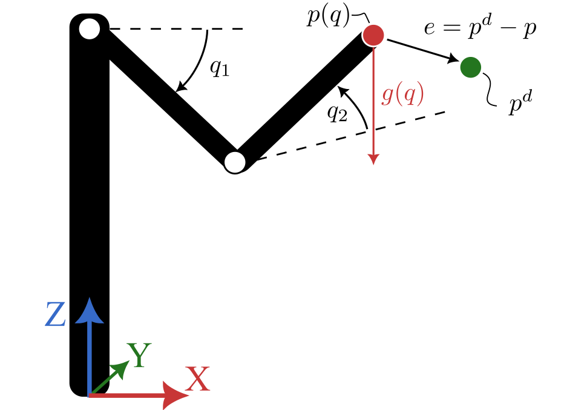

Robot modeling and OCP formulation
==================================

Let us consider a torque-controlled planar robot with links of unit link lengths and masses.
As represented in the figure below, the robot is contained in the XZ plane such that it is subjected to gravity.

The goal of the controller is to compute control torques :math:`\tau` such that the robot tracks a desired Cartesian trajectory composed of a desired end-effector position  :math:`p^d` and velocity :math:`\dot{p}^d`.

Robot dynamic modeling
---------------------------------------

The system can be described by the following dynamic model:

.. math::

    B(q) \ddot{q} + C(q, \dot{q}) \dot{q} + g(q) = \tau

where

- :math:`q = [q_1, \, q_2]^T` are the joint angles of the first and second links;

- :math:`\tau = [\tau_1, \, \tau_2]^T` are the torques applied to the first and second links;

- :math:`B(q) \in \mathbb{R}^{2 \times 2}`, :math:`C(q, \dot{q}) \in \mathbb{R}^{2 \times 2}`, and :math:`G(q)  \in \mathbb{R}^{2}` are the inertia matrix, the Coriolis matrix, and the gravity vector, respectively.

We can write the dynamic model in the form of a first-order differential equation with state :math:`x = [q, \dot{q}]^T` and control :math:`u = \tau` as follows:

.. math::

    \dot{x} = \begin{bmatrix} \dot{q} \\ \ddot{q} \end{bmatrix}
            = f(x, u)
            = \begin{bmatrix} \dot{q} \\ B(q)^{-1} (\tau - C(q, \dot{q}) \dot{q} - g(q)) \end{bmatrix}

OCP formulation
---------------------------------------

In order to track the desired trajectory, the cost function :math:`\mathcal{L}(t_k)` minimized by the predictive controller is defined at discrete time :math:`t_k` as

.. math::

    \mathcal{L}(t_k) = \int_{t_k}^{t_k + T_f} \left( \| e(t) \|^2_{Q_p} + \| \dot{e}(t) \|^2_{Q_v} + \| \tau(t) \|^2_R \right) dt

where :math:`e` and :math:`\dot{e}` are the position and velocity tracking errors, respectively, and :math:`T_f` is the prediction horizon duration.
The weighting matrices :math:`Q_p`, :math:`Q_v`, and :math:`R \in \mathbb{R}^{2 \times 2}` are positive definite matrices used to tune the closed-loop behavior of the robot.

The control problem is subject to the following constraints:

- the initial state :math:`x(t_k) = x_k` is given;

- the joint positions are bounded by :math:`q_{\min} \leq q(t) \leq q_{\max}`, with :math:`q_{\min} = [-\pi, 0]^T` and :math:`q_{\max} = [-\cfrac{\pi}{2}, \cfrac{\pi}{2}]^T`;

- the joint velocities are bounded by :math:`\dot{q}_{\min} \leq \dot{q}(t) \leq \dot{q}_{\max}`, with :math:`\dot{q}_{\min} = [-2, -2]^T` and :math:`\dot{q}_{\max} = [2, 2]^T`;

- the control torques are bounded by :math:`\tau_{\min} \leq \tau(t) \leq \tau_{\max}`, with :math:`\tau_{\min} = [-25, -10]^T` and :math:`\tau_{\max} = [20, 10]^T`.

Transcription using CasADI and Acados
---------------------------------------

The optimal control problem (OCP) is transcribed into a nonlinear program (NLP) using CasADi and Acados.
The NLP is then solved by the Acados solver, which is a high-performance NMPC solver.

1) Define the CasADi symbols and parameters
~~~~~~~~~~~~~~~~~~~~~~~~~~~~~~~~~~~~~~~~~~~~

The first step is to define the CasADi symbols and parameters of the robot model.
Here, the geometry and mass properties of the robot are defined as model parameters.

.. code-block:: python

    import casadi as ca

    # Define the CasADi symbols
    sym_q = ca.SX.sym('q', 2)         # joint angles
    sym_q_dot = ca.SX.sym('q_dot', 2) # Joint velocity
    sym_tau = ca.SX.sym('tau', 2)     # Joint torques (controls)

    # Define the CasADi model parameters
    sym_l0 = ca.SX.sym('l0', 1)  # position along Z axis of the joint [m]
    sym_l1 = ca.SX.sym('l1', 1)  # length of the first link [m]
    sym_l2 = ca.SX.sym('l2', 1)  # length of the second link [m]
    sym_m1 = ca.SX.sym('m1', 1)  # mass of the first link [Kg]
    sym_m2 = ca.SX.sym('m2', 1)  # mass of the second link [Kg]

2) Define the Acados model
~~~~~~~~~~~~~~~~~~~~~~~~~~~

The second step is to define the Acados model, which includes the state, controls, parameters, and dynamics.
More details can be found in the Acados documentation.

.. code-block:: python

    from acados_template import AcadosModel

    # Create an Acados model
    model = AcadosModel()
    model.name = 'rrbot'

    # Define the state, control, and parameters variables
    model.x = ca.vertcat(sym_q, sym_q_dot)
    model.u = ca.vertcat(sym_tau)
    model.z = ca.vertcat([])  # algebraic variables. N.B., actually used in the demo code
    model.p = ca.vertcat(
        sym_l0,
        sym_l1,
        sym_l2,
        sym_m1,
        sym_m2
    )

    sym_xdot = ca.SX.sym('x_dot', x.shape[0], 1)
    model.xdot = sym_xdot

    # Define the dynamics (not actually zeros...)
    B = SX.zeros(2, 2)  # Inertia matrix, function of q, l1, l2, m1, m2
    C = SX.zeros(2, 2)  # Coriolis matrix, function of q, q_dot, l1, l2, m1, m2
    G = SX.zeros(2, 2)  # Gravity vector, function of q, l1, l2, m1, m2
    expr_q_dot2 = ca.inv(B) @ (sym_tau - C @ sym_q_dot - G)

    # Explicit ODE model
    model.f_expl_expr = ca.vertcat(
        self.sym_q_dot,
        expr_q_dot2  # joint acc. from torques
    )

    # Implicit DAE model
    model.f_impl_expr = ca.vertcat(xdot - model.f_expl_expr)

    # Forward kinematics
    #  - Cartesian position of the end-effector
    sym_p = ca.vertcat(
        sym_l0 + sym_l1 * ca.sin(sym_q[0]) + sym_l2 * ca.sin(sym_q[0] + sym_q[1]),
        sym_l1 * ca.cos(sym_q[0]) + sym_l2 * ca.cos(sym_q[0] + sym_q[1])
    )
    #  - Cartesian velocity of the end-effector
    sym_p_dot = ca.jacobian(sym_p, sym_q) @ sym_q_dot

The full code can be found in the `rrbot_model.py <https://github.com/ICube-Robotics/acados_solver_ros2_examples/blob/main/example_acados_controller/script/rrbot_model.py>`_ file in the ``example_acados_controller/script`` directory of the `acados_solver_ros2_examples <https://github.com/ICube-Robotics/acados_solver_ros2_examples>`_ repository.

3) Define the Acados OCP
~~~~~~~~~~~~~~~~~~~~~~~~~

The third step is to define the Acados optimal control problem (OCP) by specifying the cost function, constraints, and solver settings.
It should be noted that we use a nonlinear cost function, but a linear cost could easily be used instead.

.. code-block:: python

    from acados_template import AcadosOcp
    import numpy as np

    N = 10  # default prediction horizon length (num of sampling periods)
    Ts = 0.1  # sampling time

    # Create an Acados OCP
    ocp = AcadosOcp()
    ocp.model = model

    # Declare extra parameters to use in the cost function
    sym_p_ref = ca.SX.sym('p_ref', 2)
    sym_p_dot_ref = ca.SX.sym('p_dot_ref', 2)
    sym_Q_pos_diag = ca.SX.sym('Q_pos_diag', 2)
    sym_Q_vel_diag = ca.SX.sym('Q_vel_diag', 2)
    sym_R_diag = ca.SX.sym('R_diag', 2)

    # Append extra parameters to the model parameters
    model.p = ca.vertcat(
        model.p,         # original model parameters (see rrbot_model.py)
        sym_p_ref,       # reference position
        sym_p_dot_ref,   # reference velocity
        sym_Q_pos_diag,  # weight for position error
        sym_Q_vel_diag,  # weight for velocity error
        sym_R_diag,      # weight for control (torques)
    )
    # set default parameter values
    ocp.parameter_values = np.zeros((model.p.shape[0],))

    # Define the (non-linear) cost function
    Q_pos = ca.diag(sym_Q_pos_diag)
    Q_vel = ca.diag(sym_Q_vel_diag)
    R = ca.diag(sym_R_diag)

    err_p = sym_p_ref - sym_p
    err_p_dot = sym_p_dot_ref - sym_p_dot

    ocp.cost.cost_type = 'EXTERNAL'
    ocp.cost.cost_type_e = 'EXTERNAL'
    ocp.model.cost_expr_ext_cost = \
        err_p.T @ Q_err_p @ err_p \
        + err_p_dot.T @ Q_err_p_dot @ err_p_dot \
        + rrbot_model.sym_tau.T @ R @ rrbot_model.sym_tau
    # Note: the terminal cost should be chosen more carefully in practice.
    # This is not very rigorous, but enough for the purpose of this example.
    ocp.model.cost_expr_ext_cost_e = \
        err_p.T @ Q_err_p @ err_p \
        + err_p_dot.T @ Q_err_p_dot @ err_p_dot

    # Define the constraints

    #   - placeholder for initial state
    ocp.constraints.x0 = np.zeros((model.x.shape[0],))

    #   - joint torque limits
    ocp.constraints.idxbu = np.array([0, 1])
    ocp.constraints.lbu = np.array([- 25., - 10.])
    ocp.constraints.ubu = np.array([25, 10])

    #   - joint position and velocity limits
    q_dot_max = 2
    ocp.constraints.idxbx = np.array(range(model.x.shape[0]))
    ocp.constraints.lbx = np.array(
        [- np.pi, - np.pi / 2., -q_dot_max, -q_dot_max])
    ocp.constraints.ubx = np.array(
        [0., np.pi / 2., +q_dot_max, +q_dot_max])

    #    - terminal (state) constraints
    #      (we simply replicate stage state constraints)
    ocp.constraints.lbx_e = ocp.constraints.lbx
    ocp.constraints.ubx_e = ocp.constraints.ubx
    ocp.constraints.idxbx_e = ocp.constraints.idxbx

    # Set solver options
    ocp.solver_options.N_horizon = N  # number of shooting nodes
    ocp.solver_options.tf = N * Ts  # prediction horizon in seconds
    ocp.solver_options.nlp_solver_type = 'SQP_RTI'
    ocp.solver_options.integrator_type = 'IRK'  # use implicit DAE model
    ...  # other solver options (see the full code or Acados documentation details)

All done, at this point, the OCP is fully defined and can be used in Python applications (see `AcadosOcpSolver <https://docs.acados.org/python_interface/index.html#acados_template.acados_ocp_solver.AcadosOcpSolver>`_).

The full code can be found in the `export_acados_solver_plugin.py <https://github.com/ICube-Robotics/acados_solver_ros2_examples/blob/main/example_acados_controller/script/export_acados_solver_plugin.py>`_ file in the ``example_acados_controller/script`` directory of the `acados_solver_ros2_examples <https://github.com/ICube-Robotics/acados_solver_ros2_examples>`_ repository.

Notes
------

- The cost function is implepmeneted as a ``EXTERNAL`` non-linear function, but the ``NONLINEAR_LS`` cost function could be used instead for better performance.

- This is an example application, but in practice additional features could be implemented, such as:
    - considering a more rigorous terminal cost function (e.g., LQR-like) and constraints (e.g., terminal set);
    - adding some slack to state constraints;
    - using the derivative of the torque as control variable (instead of the torque itself) so as to limit jerk.
